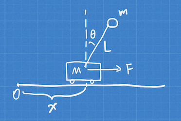
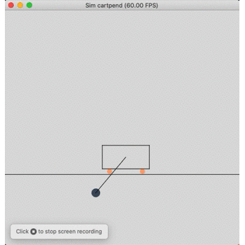
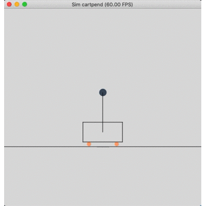
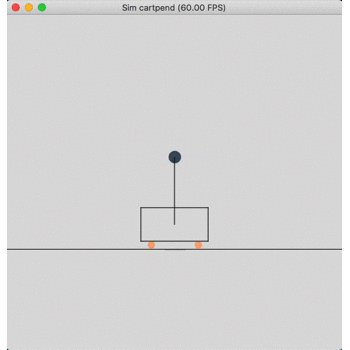
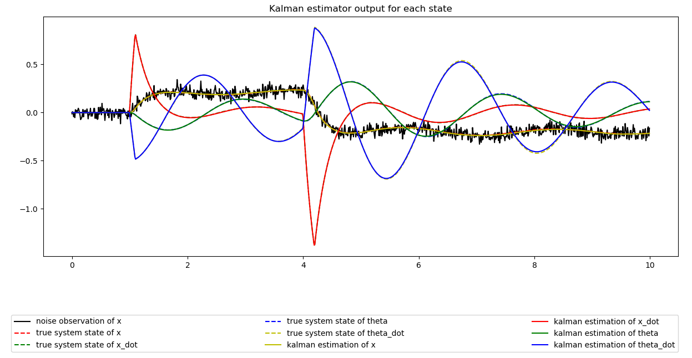
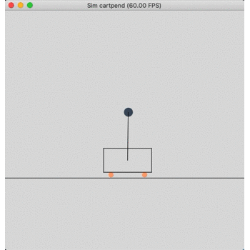

# Inverted Pendulum Control
A python version of inverted pendulum control code from [control boot camp](https://www.youtube.com/watch?v=Pi7l8mMjYVE&list=PLMrJAkhIeNNR20Mz-VpzgfQs5zrYi085m).

## Dependencies
Python 3
- numpy
- taichi (0.6.8)
- control
- matplotlib
- scipy
  
Maxima
- wxmaxima (for gui)

## Math part
### a. Cart-pend system definition


### b. Dynamics equations
Use wxmaxima for lagrange euqation computation. Please refer to pyVersion/cartpend.wxmx

## Result
```shell
cd pyVersion # for run all script
```

### 1. Cartpend Simulation
```shell
python sim_cartpend.py
```


### 2. Pole placement
```shell
python poleplace_cartpend.py
```

- To visualize how linearizad model perfroms at place away from linearized point, run:
    ```shell
    python linearize_cartpend.py
    ```
### 3. LQR control
Here I add a periodical force to the cart to make the control process have more visual impact.
```shell
python lqr_cartpend.py
```

- To play with observability, run:
    ```shell
    python obsv_cartpend.py
    ```
### 4. Kalman estimator
```shell
python kf_cartpend.py
```


### 5. LQG control (Kalman estimator + LQR control)
Here the controller is move the cart-pend system from initial state (x, x_dot, theta, theta_dot): [0.0, 0.0, 0.0, 0.1] to [0.3, 0.0, 0.0, 0.0]

```shell
python lqg_cartpend.py
```
